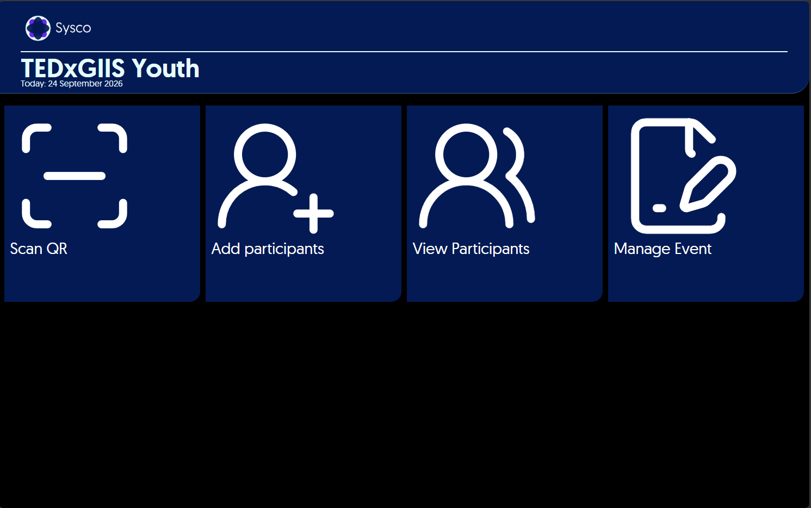
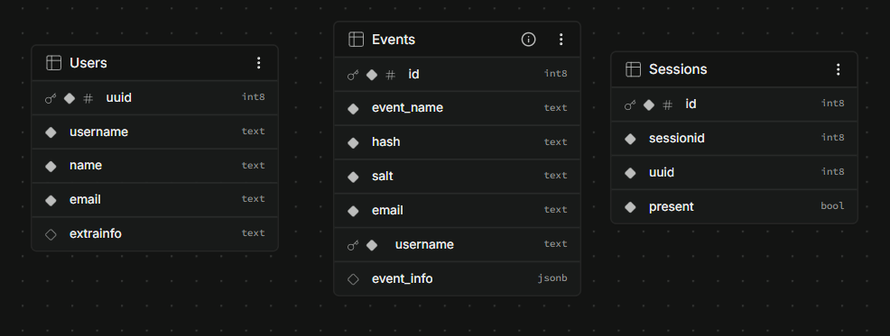

# Sysco Events

Sysco events is a easy to use event suite that helps you manage your event with ease, the Sysco event suite lets you do the following

* Check-In partcipants
* Add participants and manage their details
* Manage Participants using the UI
* Manage your event details
* Email participants their event tickets, individually or all at once.

While you can use Sysco using the demo link [sysco event scheduler](https://sysco.giisclubs.org) you may use the below information to setup your own version of sysco.

## Setup
1. Make a copy of .example.env and rename it to just ".env"
2. Fill in the the API keys required (includes mailtrap and supabase)
3. Setup the supabase database as follows

4. Start the server, this should run smoothly

### Additional Info
Since the emails are formatted as html, you may make changes or edit them on the index.js file with contains 2 emails

- Event Schedule email (to organisor)
- Ticket email (sent to participants)

